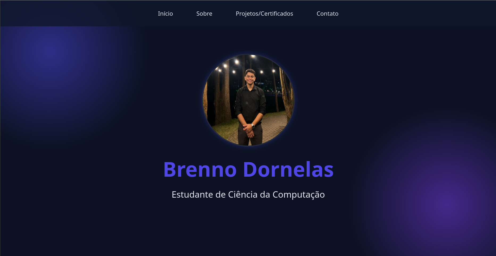

---

## ✨ Funcionalidades

- Design responsivo para vários dispositivos  
- Seção de apresentação pessoal  
- Lista de habilidades aprendidas na disciplina  
- Área de projetos desenvolvidos  
- Botão ou função para contato via WhatsApp / email  
- Menu de navegação simples e intuitivo

---

## 📸 Demonstração 
>
> 
>
---

## 📚 Aprendizados

Durante o desenvolvimento deste projeto, aprendi:

- Estruturar páginas web usando HTML
- Criar layouts utilizando CSS e Flexbox/Grid
- Manipular elementos com JavaScript
- Trabalhar com eventos e funções
- Organizar arquivos e pastas de um projeto web
- Publicar projetos utilizando Git e GitHub

---

## 👨‍💻 Autor

**Brenno Dornelas de Medeiros Filho**  
Estudante da disciplina de **Introdução à Computação**  
Instituição: CESSAR School  

---

## 📬 Contato

- Email: *bdmf@cesar.school*
- WhatsApp: *+55 (87)98136-1258*
- [GitHub](https://github.com/BrennoDornelasMF)

---

## 🏁 Status do projeto

✔️ Concluído — versão final para entrega da disciplina

